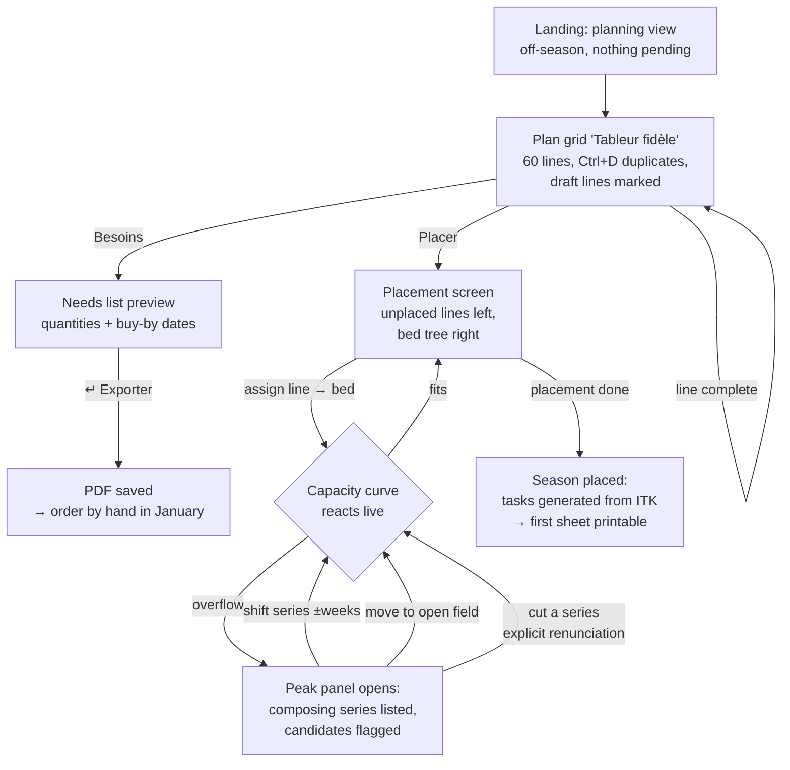
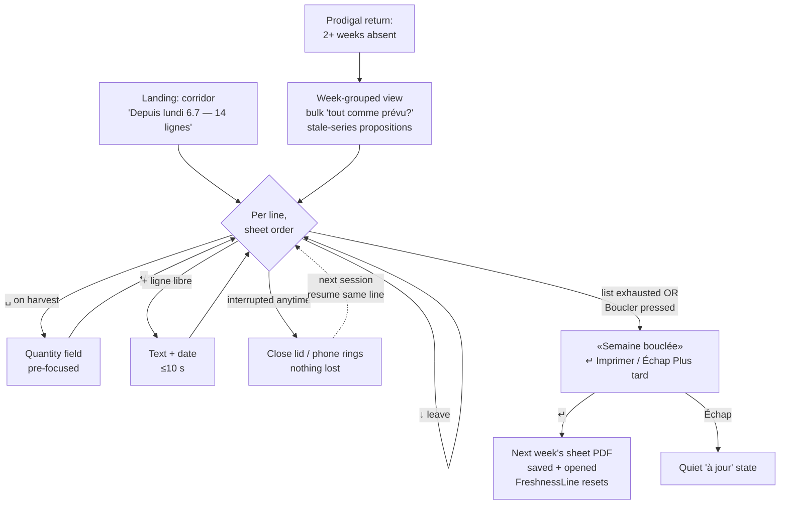
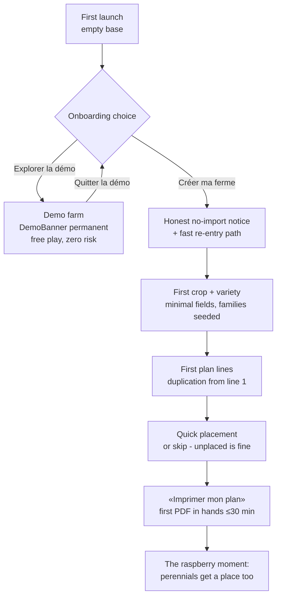

# UX Design Specification pomone

**Author:** Guy
**Date:** 2026-07-11

---

<!-- UX design content will be appended sequentially through collaborative workflow steps -->

## Executive Summary

### Project Vision

Pomone is the maintained, free successor to QRop: a local-first desktop crop planner whose **primary deliverable is paper** — the printed multi-day field sheet the grower actually carries. The UX serves a two-phase planning workflow (plan crops → place them under a live capacity curve), a weekly batch reconciliation running on residual attention, and five-plus printed documents that must be trusted for a full season. The screen exists to feed the paper and absorb its return — and the return closes a **ritual**: finishing the weekly catch-up hands you next week's sheet.

### Structuring Principle: «Two tempos, one app»

Thursday, you **record**: gloved-tired, three gestures per line, ≤15 min for a week, interruptible anywhere. Sunday (in January), you **decide**: armchair, contemplation, arbitrage. Every screen declares its tempo, and the acceptance question is built in: *is this flow playable gloved-and-tired in three gestures — or does it deserve an armchair?* The bridge between tempos: Thursday's recorded facts feed Sunday's decisions (actual vs planned).

### Target Users

- **Guy (primary, dogfooding):** market gardener + orchard, 50–60, boots the PC 1–2×/week for invoicing; Pomone gets the leftover minutes. Domain expert, software-intermediate, zero tolerance for ceremony.
- **Marie (adoption):** QRop orphan, five years of dense-spreadsheet habits; first printed plan in ≤30 min unaided, in French; owns her data.
- **The English-locale grower (parity):** same journeys, every label and document bilingual.
- **The field is not an interaction context** — pencil on paper is the field interface. But the printed PDF has a **phone plan B**: it must survive zoom-and-pan reading (clear hierarchy, never 12-column tables, B&W contrast). A property of the document — never a Trojan horse for a mobile app.

### Key Design Challenges

1. **The reconciliation screen is a race against fatigue** *(blocking R1)* — three gestures per line, interruptible at any line, zero loss, exact resume. Every extra click is a defection risk.
2. **Printed documents are the flagship UI** *(blocking R1)* — designed for B&W, outdoors, pencil interaction, photocopy survival, self-contained semantics. **The journal sheet is a form, not an output**: the handwriting vocabulary (✓ done, quantity+unit, carry-over arrow, skip motif) is part of the design and printed in the legend.
3. **Entry at real-farm volume** *(blocking R1)* — 60+ plan lines without form fatigue: duplication, prefilled propositions, «never asks what it knows», no Save button.
4. **The capacity moment carries a decision** *(important, degradable)* — the curve shows AND explains the overflow; the sacrifice stays possible on-screen. (Capacity *mechanics* belong to the epics; the spec owns how the sacrifice is shown.)
5. **«One language, two densities»** — new dense work-surfaces (reconciliation, plan table) and existing airy cards must be one design system with a compressed vertical rhythm as a *setting*, never a second language.
6. **Legibility retrofit, bounded** — the filled=editable / no-fill=read-only grammar is specified here, applied to all *new* screens; retrofitting existing screens is a post-R1 debt epic (at most one existing view retrofitted in R1 if reconciliation reads it).
7. **Seasonal re-learnability** *(comfort R1)* — after two months away, every screen answers «where am I, what can I do»; the catch-up start screen is this challenge's answer, and the pile of dated printed sheets is its tangible memory.

### Design Opportunities

1. **The paper loop as signature — and as ritual.** No competitor designs the printout as the hero artifact; closing reconciliation with «next week's sheet is ready» makes printing the reward of recording.
2. **Warm identity, borrowed density** — the existing orchard palette and airy cards differentiate from QRop; the work surfaces borrow QRop's per-row productivity where it counts.
3. **The FR/EN glossary as design deliverable** *(readiness gap #1 — form decided)*: canonical `docs/glossaire.md` (term_id, FR, EN, definition, Fluent key prefix), CI coherence test glossary↔`.ftl`, glossary version printed on every document, human review on change. ~14 founding terms proposed (notably **série→succession**, **abandonnée→skipped**, planche→bed, itinéraire technique→growing schedule; «carnet de traitements» to be checked against the regulator's own wording).
4. **The three aha moments** (capacity check, plan→dated tasks, faithful re-print) are each a designable scene.

## Core User Experience

### Defining Experience

**The reconciliation line.** The most frequent interaction: reconciling one paper line with **four gestures** — *done* (Space; extends itself when the task asks for more: a harvest line opens a pre-focused quantity field, Enter-empty to pass; `N` adds an optional note), *skipped* (X, then optional inline reason 1–4), *carried over* (`R` + quick date — the virtuous explicit alternative to silence), or *leave* (arrow down, free — but a line left ≥2 weeks changes state visibly and surfaces). Plus the first-class **«+ free line»** gesture: unplanned real work enters as raw text + date in ≤10 seconds, no categorization (structured journal is R2). A week is 20–60 gestures; the screen mirrors the printed sheet's order so the eye copies instead of scanning.

The second defining experience, on the armchair tempo: **placing a crop and watching the capacity curve answer** — including the April overflow that forces a named sacrifice.

### Platform Strategy

- **Desktop Linux first**, mouse + keyboard; **keyboard-first on sprint surfaces** with **physical key positions, never localized mnemonics** (Space=done, X=skip, R=carry-over, 1–4=reasons, Enter=validate/extend, arrows=navigate; shortcuts displayed at list foot — muscle memory survives the FR/EN switch).
- Slint implementation constraints (validated): one centralized `FocusScope` per screen with `current-index` (never per-row focus in a recycling ListView), skip reasons **inline** (never `PopupWindow`), date editing via a single conditional `LineEdit` with explicit focus restitution (footer fallback), line-local model updates (`set_row_data`) with the model handle kept by the wiring module. Gesture-flow state lives in `pomone-app` as pure functions — unit-testable without UI.
- 100% offline; modest hardware; PDF-to-Documents printing; existing nav skeleton kept.

### Contextual Landing

The app opens where the data says the user is: **empty base → onboarding path** (create first crop / load demo — never an empty catch-up mirror); **unreconciled lines > 0 → catch-up screen**, cursor on first line; **nothing pending + off-season → planning view** (the year's plan, the curve, «your April already overflows»). No question asked — «never ask what it knows» includes «where do you want to land».

### Effortless Interactions

- **Opening = resuming**, at the exact line. **Dates come from the paper** (column → proposed `occurred_at`). **Duplication over creation** for plan lines. **Printing is the reward**: closing reconciliation offers next week's sheet. **Nothing asks to be saved, ever.**

### Critical Success Moments

1. **Marie's first print** (≤30 min unaided).
2. **The April overflow**, explained, with the sacrifice made on-screen.
3. **The faithful Thursday re-print** — done stays done, skipped stays gone.
4. **The 4-minute interrupted catch-up** — leave at line 6, resume at line 7.
5. **The prodigal return**: two absent weeks, 80–120 late lines — grouped by week, with honest bulk propositions («these 12 sowings are probably stale — carry the series over?»). Explains, never prescribes; the day this scene fails is the day the app gets abandoned.

### Experience Principles

1. **Two tempos, one app** — sprint screens keyboard-first, dense, linear; armchair screens breathe and explain.
2. **Never ask what it knows, never more than one line at a time.**
3. **The paper is the product** — the screen mirrors the sheet, feeds it, absorbs its return.
4. **Nothing is ever lost, nothing is ever silent** — instant line persistence; explicit corrections; unplanned work is first-class; a lingering «leave» becomes visible.
5. **Explain, never prescribe** — from the capacity peak to the stale-sowing proposition.

**Success metric (operational):** in-app reconciliation chrono (first gesture → «week closed», suspends on interruption), local-only alert after 2 consecutive weeks >15 min (zero telemetry — shown to the grower alone); acceptance datasets **S-40** (40 lines, 70% done-as-planned) ≤10 min and **S-april** (60 lines + 8 unplanned) ≤15 min.

## Desired Emotional Response

### Primary Emotional Goals

**Calm trust.** The defining feeling: *my season is held, and nothing will betray it* — not the tool going paid, not a printout lying, not a validated line vanishing. Pomone's emotional promise is the transformation from the solitary mental load of planning-by-memory to the calm of seeing the whole year at a glance and trusting the paper in your pocket.

Secondary feelings: **quiet mastery** (the sacrifice made in January instead of in mud), **unceremonious accomplishment** (week closed, next sheet ready — the nod of a job done, not a fanfare), **ownership** (Marie's «a home nobody can take away»).

**Emotions to avoid:** guilt (lateness is never reproached), loss-anxiety (no «unsaved changes», ever), feeling judged («skipped» is a management decision), overwhelm (the prodigal return is grouped and bounded), infantilization (no confetti, no coach-speak).

### Emotional Journey Mapping

- **Discovery:** recognition — «someone understands how a farm actually works» (paper-first, perennials included, no cloud).
- **First print (Marie, ≤30 min):** tangible pride — her plan, on her table, in her language.
- **The weekly return:** efficiency without ceremony — and never guilt. The freshness line states a fact, it never scolds.
- **When something went wrong** (wrong tick, dead planting, skipped pass): forgiveness by design — corrections explicit, easy, blame-free; wording in both languages carries zero reproach.
- **Returning after absence** (two weeks, two months): welcomed back, not confronted — grouped catch-up, honest propositions, the pile of printed sheets as gentle memory.

### Micro-Emotions

- **Trust vs. skepticism** — decided at the third faithful re-print; one clobbered «done» kills it permanently.
- **Confidence vs. confusion** — the field grammar (filled=editable) and tempo clarity answer «can I touch this?» before the question forms.
- **Flow vs. tedium** — the tac-tac-tac: visible progress («9 of 14»), proportional cost, keys under the fingers. Fifteen ticks should feel *better* than one, not fifteen times worse.
- **Relief vs. guilt** — skipping without mandatory justification; leaving without warning dialogs; closing the lid mid-list without consequence.
- **Fearless exploration (demo)** — «nothing I break here counts», stated by the banner itself: the emotional antidote to the blank-page wall.

### Design Implications

- Calm trust → nothing blinks, nothing nags, no red except true data danger; the re-print always available as reassurance.
- No guilt → freshness and lingering-line signals factual and neutral; the >15-min alert visible to the grower alone, phrased as observation, not verdict.
- Quiet accomplishment → closing gesture = «Semaine bouclée» + next sheet offered; the reward *is* the artifact.
- Forgiveness → every terminal state reversible as explicit correction; undo language («corriger»), never accusatory.
- Ownership → data location visible in Settings, backups one click away, exports open formats.
- Fearless demo → visible banner naming the sandbox; entering and leaving the demo is one action; real data provably untouched.

### Emotional Design Principles

1. **The tool never scolds** — it states, proposes, and waits.
2. **Trust is earned in print** — every emotional promise cashes out at the printer.
3. **Sobriety is respect** — a farmer's tool celebrates like a farmer: briefly, then back to work.
4. **Forgiveness by default** — the design assumes tired hands and interrupted evenings.

## UX Pattern Analysis & Inspiration

### Inspiring Products Analysis

- **QRop (the ancestor):** adopt the productive density of its work surfaces (sortable columns, search, per-row efficiency); reject its scattered catalog, neglected printing, and everywhere-density.
- **The paper notebook & field agenda (the true incumbent):** inherit its field qualities — zero startup, total interruption tolerance, free annotation, the tangible pile as history. **Its fatal flaw (owner-named): the copy chain** — notebook → synthesis → hand-copying into official forms. Pomone's counter-principle, elevated to **brand promise: «Saisi une fois, produit partout» / «Entered once, produced everywhere»** — displayed, user-opposable, an acceptance criterion for every feature. No data entered in Pomone is ever re-entered elsewhere for an official use.
- **Email triage (transferable flow):** reconciliation = inbox triage — one line at a time, one-key gestures, descending counter, «week closed» as inbox-zero, next week's sheet as the reward.
- **Todoist (owner's daily app):** natural date entry — as a **closed grammar** (`mar`/`tue`, `+3j`/`+3d`, `15.7`, `auj`/`dem`), rule-parsed offline FR/EN, with a **real-time confirmation echo** («mar → mardi 14.7») before validation; the Today view as catch-up mental model; the clean completion tick. Rejected: karma/streaks, and the infinite task-inbox metaphor — Pomone plans crops, not to-dos.
- **GitHub (owner's daily app):** the immutable history matches the fact journal (D1) — corrections as new events, never rewrites; the retrospective borrows the **diff form without the diff costume**: per-line «prévu 12.3 → réel 19.3 (+7j)», amber/neutral deltas (never fault-red), conforming lines greyed — bank-statement legibility. Semantic state badges allowed; **merit badges vetoed**.
- **LibreOffice Calc (the outgoing tool):** the plan grid speaks spreadsheet — arrows, type-to-edit, Enter advances, fill-down duplication — **inheriting Calc's gestures, never its permissiveness**: typed cells, validation on cell exit (inline refusal, Échap restores), derived columns visually distinct and non-editable (or flagged «forced value»). Acquisition message: *the spreadsheet you know, with the safety it never had* (the door; the paper ritual is the house).
- **claude.ai (owner's daily app):** propose-and-let-the-human-dispose (our «explain, never prescribe»); long-reading typographic sobriety for armchair screens; confirms the stage-0 AI workflow.

### Transferable Patterns — by surface

Reconciliation ← mail triage + Todoist (one-key gestures, natural dates). Plan grid ← Calc (keyboard grid, fill-down). Retrospective ← GitHub (history, prévu→réel). Armchair screens ← claude.ai (air, propositions). Printed sheet ← the notebook's field virtues, structured at capture.

### Human Corrections (design-thinking pass)

- **Optimize cost-per-decision, not throughput:** thick fingers, reading glasses — choosing beats typing; large targets; free text never mandatory; «everything as planned» is one big gesture, only exceptions cost entry.
- **The pile is a haystack, never a red counter** — seasonal accumulation is weather, not fault.
- **The tour de plaine ordering:** within a day, tasks ordered bed-by-bed in walking order — on the printed sheet and on screen; reconciliation as a walk, engaging body memory.
- **The workshop silhouette:** what's missing shows as an empty outline, not an alarm.
- **The closing gesture:** «Semaine bouclée» as a physical-feeling full stop — the counted till, the closed notebook.

### Anti-Patterns to Avoid (consolidated)

The notebook→synthesis→official-forms copy chain · KPI dashboards before gestures · cloud-first anything · merit badges, karma, streaks (semantic state badges only) · the infinite task-inbox metaphor (crops, not to-dos) · NLP illusion (closed grammar + echo, or nothing) · per-keystroke validation (cell-exit only) and silent free-for-all editing (Calc's sin) · fault-red for deviations (amber/neutral; red = data danger only) · red counters on seasonal piles (haystack, not inbox) · small click-targets and mandatory free text on sprint surfaces · two look-alike navigation models on neighboring screens.

### Pattern Coexistence Rules

The triage **corridor** (Thursday sprint: full-width, one line at a time, counter) and the grid **workshop** (winter sessions: dense, multi-line) must *not* look alike — visual distinctness switches the mental mode. Single transversal invariant: **Échap = cancel, everywhere, same meaning.** Hierarchy test for every borrowed mechanic: *«how do you serve the paper loop?»* — no answer, no feature.

### Pre-Implementation Validation (recommended action)

**The Thursday-evening paper test:** transcribe one real week from the owner's own notebook into a printed A4 mock of the reconciliation screen; one real Thursday after invoicing, hand it over with a pencil («tick what went as planned, correct the rest»), wizard-of-Oz, discreet timing, watch the hands. Success: <10 min and «c'est tout ?». Invalidation: sighs, skipped lines, pushed-away sheet. Cost: one print and a coffee — runs before any Slint code.

## Design System Foundation

### Design System Choice

**Evolve the existing custom Slint theme («Verger») into a documented, two-medium design system** — the only option that is both technically real (no third-party Slint design systems exist; web systems don't transfer) and brand-true (the warm orchard identity already differentiates from QRop).

Its defining originality: **the system covers two media** — the screen (Slint components) and **the paper** (PrintDoc visual language). Both share one identity; the paper tokens (checkbox ☐/☒, strikethrough for skipped, hatching vs solid for occupancy, bold = today, ≥40% greys only, per-page header/legend) are first-class citizens of the system, not an afterthought of the PDF renderer.

### Rationale for Selection

1. **Brownfield reality:** `theme.slint` already defines Palette (#3C6E47 leaf green, #B85C38 terracotta, #FBF7F0 cream), spacing/typography tokens, and the `Themed*`/`Card` component family — shipped and consistent.
2. **No viable established option** for Slint.
3. **The two design debts named in discovery become system features:** the field-grammar states (filled=editable / no-fill=read-only — fixing the known «fields don't stand out» issue) and the **density scale** («one language, two densities»: default rhythm for armchair cards, compressed rhythm for sprint surfaces — same tokens, one vertical-step variable).

### Implementation Approach

- **Formalize tokens** in `theme.slint` (single source): colors (incl. amber/neutral delta; danger-red reserved for data loss), spacing with `density` variant, type scale (incl. the R2 large-print factor), field-state styles, focus/current-line treatment for keyboard surfaces. **Every new token is defined in light AND dark from day one** (dark tokens exist, toggle is post-v1 — new screens must not deepen that debt). Paper documents are B&W by definition.
- **New sprint components** join the family: `TriageRow` (the four-gesture line: current-line highlight, inline reason strip, extension field), `GridCell` (typed, exit-validation, derived/forced markers), `CounterFoot` (progress + shortcuts display), `EmptyOutline` (the workshop silhouette), `DemoBanner` (the permanent, reassuring sandbox strip), `FreshnessLine` (the factual «last entry N days ago» — one wording, two renderings: screen and paper).
- **Iconography continuity:** Material Icons glyphs remain the system's icon set (shipped, and familiar to QRop migrants).
- **Paper tokens** live in `print/mod.rs` as PrintDoc styling constants, documented alongside the screen tokens — one design-system doc, two rendering targets.
- **The FR/EN glossary is part of the system** (`docs/glossaire.md`, term_id → Fluent prefix): terminology is a design token like color.

### Customization Strategy

Tokens first, components second, screens last. New screens compose existing + new components; zero per-screen colors or paddings (a hardcoded hex in a screen file is a review reject). Existing screens adopt the formalized tokens opportunistically (the bounded retrofit — debt epic).

## Defining Experience: «Boucler la semaine» (the weekly reconciliation corridor)

### The One-Sentence Pitch

*«Tu poses ta feuille à côté du clavier, tu descends la liste — pouce sur Espace — et quatre minutes plus tard, ta semaine prochaine sort de l'imprimante.»*

### User Mental Model

The user arrives from **the paper**: his mental model is «recopier ma feuille», not «gérer des tâches». The screen is the sheet's mirror — same lines, same order (day, then bed in walking order), same states. Confusions designed against: *«do I have to fill everything?»* (no — leave is free, the haystack doesn't judge), *«did it save?»* (there is no save — the line settles the instant it's validated), *«I made a mistake»* (any line reopens with Enter; corrections explicit, never scary).

### Success Criteria

- S-40 week (40 lines, 70% as planned) closes in **≤10 minutes**, in-app chrono as witness.
- **Zero mouse required** from opening to «Semaine bouclée».
- Mid-list interruption costs nothing: no dialog, no loss, resume at the same line.
- No documentation needed: footer shows the keys; first-run shows one hint per gesture, then never again.
- After closing: **one keypress** prints next week's sheet.

### Novel vs. Established Patterns

Established, deliberately: email-triage corridor + spreadsheet-adjacent rows + paper checkbox semantics. The novel twist (paper teaches it): the sheet's dated columns drive the proposed dates — **the paper is the input device**. Only new micro-pattern: the inline reason strip (X then 1–4), self-revealing, two keystrokes.

### Experience Mechanics

**1. Initiation.** App opens on the corridor (contextual landing): header «Depuis lundi 6.7 — 14 lignes · feuille du 6–12.7», current line highlighted, footer: ␣ Fait · X Abandonné · R Reporter · N Note · ↵ Ouvrir/Étendre · Échap Annuler · + Ligne libre · [Boucler]. Haystack framing: «14 lignes de ta feuille», never a red badge.

**2. Interaction, per line.**
- **␣ (Fait):** marks done with the column's date; quantity-bearing tasks (harvest) extend a small pre-focused field — type or Enter-through. Cursor advances.
- **X (Abandonné):** inline reason strip — `1 Trop tard · 2 Météo · 3 Inutile · 4 Autre` — one digit, strikethrough, advance. Escape cancels.
- **R (Reporter):** compact date field, closed grammar + live echo («+3j → jeu. 16.7»); Enter migrates the line to its new date group.
- **↓/↑:** move; **leave is silence** — free; a line ≥2 weeks old wears its age quietly (amber left edge, empty-outline silhouette).
- **+ (Ligne libre):** text + date (echo grammar), Enter — unplanned work lands in ≤10 s, uncategorized.
- **↵ on a settled line:** reopens for explicit correction («corriger» wording).
- **Bulk (prodigal return):** week-group headers offer «tout comme prévu ?» — one gesture accepts the group, lines remain individually overrideable.

**3. Feedback.** Each validated line: instant visual settle (~150 ms, no animation theater) + counter «9 sur 14». Writes are synchronous — marked = persisted. Field errors refuse inline; nothing modal, ever.

**4. Completion — an explicit act, never a gate.** «Boucler la semaine» is **always available** (footer), even with lines left pending — they stay in the haystack for next time; the user decides when the week is finished, not the counter. When the list is exhausted, the footer swells gently into the invitation: **«Semaine bouclée — Imprimer la feuille du 13–19.7 ?»** [↵ Imprimer · Échap Plus tard]. Enter → PDF saved & opened, chrono stops, the corridor settles into the quiet «à jour» state with the FreshnessLine. The reward is the artifact.

**Chrono semantics:** pauses automatically on window blur or >2 min inactivity, resumes on the next gesture — never a pause button to think about.

## Visual Design Foundation

### Color System (existing, formalized — `theme.slint` is the source of truth)

- **Identity:** leaf green `#3C6E47` (primary), terracotta `#B85C38` (accent), warm cream `#FBF7F0` (light surface), dark olive `#1B2018` (dark surface). Full light/dark derivation from the single `Palette.dark` toggle — WCAG AA verified on every surface (shipped).
- **Semantic mappings, extended for the convergence:**
  - `warning` amber (#B07C25 / #E3B567) is the **delta color**: prévu→réel deviations, aging «left» lines — never red.
  - `danger` red (#A64238) is **reserved for data danger** — its scarcity is a design rule; red on a screen means «stop and read».
  - `success` = primary green: done lines settle into it, quietly.
  - `focus-ring` (#6A9F77) doubles as the **current-line treatment** on keyboard corridors (left bar + tinted row).
  - New neutral: **`settled`** — the grey of reconciled/conforming lines and derived grid columns, defined light+dark, AA-checked.
- **Paper palette:** pure B&W + ≥40% greys, hatching for occupancy; screen palette maps to paper as *weight and texture, never hue* (bold=today, strikethrough=skipped, outline=missing).

### Typography System

- **Existing scale kept:** body 18px, label 17px, h3 22, h2 27, h1 36, numeric 31 — the deliberate middle ground between QRop's 14px density and comfort.
- **Extensions:** `font-size-row` (≈16px) for sprint surfaces (one step down, never two); **tabular figures discipline** for grids and the corridor (dates and quantities align — if the default font disappoints under the software renderer, revisit with an embedded UI font once the grid exists); the **R2 large-print factor** multiplies the whole scale (×1.15) at token level.
- **Paper typography:** DejaVu Sans (embedded, architecture decision) at 9–10pt body, bold for today/headers — validated by the photocopy test.

### Spacing & Layout Foundation

- **Existing 4px scale kept** (`space-xs 4 → space-3xl 40`).
- **The density variant («one language, two densities» mechanism):** a `density` factor on vertical paddings only — armchair 1.0 (current cards), **sprint ≈0.6** (row ~34–36px vs 46px today). Horizontal spacing and type family never change: same language, tighter breath.
- **Layout principles:** corridor = single full-width column, fixed header/footer; workshop grid = sticky header, no horizontal scroll at 60 lines (columns that matter fit — overflow goes to row detail); armchair = existing card system unchanged.

### Motion Tokens

`duration-settle: 150ms` (line settle, state changes), `duration-zero: 0ms` (everything else — navigation and focus moves are instant); one standard ease-out, no springs, no bounces. Motion exists to *confirm*, never to entertain — and instant navigation is what keyboard-speed feels like.

### Accessibility Considerations

- WCAG AA maintained; new `settled` grey AA-checked on both surfaces.
- Focus always visible; keyboard path complete on sprint surfaces (zero mouse).
- Targets ≥ existing button sizes on decision surfaces (cost-per-decision: thick fingers).
- Large-print factor (R2) at token level; dark-mode parity enforced for every new token from day one.
- **Color never carries meaning alone:** amber deltas carry the «(+7j)» text, skipped carries the strikethrough, states carry words — the B&W paper is the proof this discipline holds.

## Design Direction Decision

### Design Directions Explored

Interactive showcase: `ux-design-directions.html` — four reconciliation-corridor directions (A strict ribbon · B day-grouped sheet mirror · C split with sheet mini-map · D dense QRop-style table), two plan-grid directions (1 faithful spreadsheet · 2 hybrid card-rows), plus the **printed journal sheet mock** (A4, B&W, dated columns, tour-de-plaine order, ≤6-symbol legend — doubles as the Thursday-evening paper-test artifact) and the **placement/capacity screen** (Sunday armchair: occupancy curves covered/open, the April peak explaining its composing series).

### Chosen Direction

- **Reconciliation corridor: Direction B — «Journal groupé»** (day-group headers mirroring the sheet's columns, tour-de-plaine order within days, inline reason strip). Direction A is B's natural state for short lists; Direction C (sheet mini-map) is kept as an option pending the Thursday-evening paper test; Direction D rejected (2D table navigation conflicts with the plan grid — mode-error risk).
- **Plan grid: Direction 1 — «Tableur fidèle»** (white editable cells vs grey-italic derived columns, focus-ringed editing cell, Enter advances, Ctrl+D duplicates) — it is Calc being replaced, not the cards.
- **Journal sheet and capacity screen mocks adopted** as the reference intent for their surfaces.

### Design Rationale

B maximizes the «the eye copies, never scans» economy (the sheet's mirror); 1 honors the Calc muscle memory while fixing its sins (typed cells, visible derivation). Both respect the corridor≠workshop distinctness rule and the density variant.

### Implementation Approach

The showcase's row heights, groupings and token usage are the visual acceptance reference for `reconcile.slint` and `plan.slint`; the A4 mock feeds the PrintDoc weekly-sheet builder and the pre-code paper test.

## User Journey Flows

### Flow 1 — Winter planning: plan → place → arbitrate → order (J1, armchair)

Error/recovery: a mistyped quantity refuses at cell exit; deleting a placed line warns only if tasks were already reconciled against it (data danger = red); everything else silently undoable via plan editing (correction ≠ replan surfaced only when a planting is `active`).

### Flow 2 — The weekly loop (J2, sprint — the product's heartbeat)

### Flow 3 — First run to first print (J4/Marie, ≤30 min)

### Flow 3b — Retro-entry of existing perennials (J3)

Planting form with a past establishment date → the planting lands directly `active`, and the confirmation states the guarantee explicitly: *«Établi en 1996 — aucune tâche passée ne sera créée ; prochaines tâches : taille hiver 2027»*. One screen, one reassurance line — the avalanche fear answered before it forms (same pattern as the peak panel: state the fact, show what happens next).

### Journey Patterns (standardized across flows)

- **Landing reads the state** — one contextual entry decision (empty / pending / off-season).
- **The panel explains, the user acts**: capacity peak, stale-series propositions, no-import notice — same shape: facts + options, never auto-action.
- **Print is always the exit** — every flow ends on a PDF in Documents; the artifact is the closure.
- **Escape hatches everywhere** — every flow leavable at any node, zero loss; «later» is always an answer.
- **Progressive commitment** — unplaced lines fine, pending lines fine, demo before real: the tool never demands completeness before giving value.

### Flow Optimization Principles

Minimize steps-to-artifact (needs list without placement; first print without full plan); one decision per screen moment (the peak panel isolates the arbitrage); feedback within the gesture (echo, settle, counter) — never after-the-fact dialogs.

## Component Strategy

### Foundation (existing, reused as-is)

`Card`, `PrimaryButton`/`SecondaryButton`, `ThemedLineEdit`/`ThemedComboBox` (upgraded by the field-state grammar), `SectionHeader`, `Timeline`/`Timegraph` (Gantt), filter chips, `TooltipCatalog`. Everything armchair reuses the card system.

### Custom Screen Components

**`TriageRow`** — the corridor line. *Anatomy:* checkbox glyph · task label · bed (min-width, muted) · date (tabular) · optional badges. *States:* pending / current (focus-ring left bar + tint) / done (settled grey, ✓) / skipped (strikethrough) / aging (amber left edge + empty-outline) / extended (quantity or note field open) / reason-strip open. *Interaction:* consumes no focus itself — rendered from `current-index`; all keys handled by the screen's FocusScope. *Accessibility:* row height ≥34px, state never color-only.

**`ReasonStrip`** — inline 4-choice band under a TriageRow. Digits 1–4, Échap closes. Never a popup.

**`DayGroupHeader`** — «Mercredi 8 juillet — tour : Serre 1 → A»; collapsed shows «4 lignes, tout est saisi ✓»; bulk variant carries «tout comme prévu ?» (prodigal return).

**`GridCell`** — typed plan-grid cell. *Variants:* editable (white) / derived (grey italic, non-focusable) / forced (dotted underline + badge). *States:* view / editing (focus ring, single conditional LineEdit) / refused (inline message, Échap restores). *Interaction:* type-to-edit, Enter advances row, Ctrl+D duplicates line.

**`DateField`** — closed-grammar input with live echo («+3j → jeu. 16.7»); unparseable input shows the grammar hint.

**`FreeLineInput`** — the «+ ligne libre» gesture: text field + DateField, attached above the CounterFoot, opened by `+`, validated by Enter, ≤10 s in hand. Reused in R2 (observation journal).

**`CounterFoot`** — fixed footer: keys legend + «9 sur 14» + [Boucler]; swells into the completion invitation when the list is exhausted.

**`PeakPanel`** — capacity overflow explainer: amber header, composing series with candidate badges, closing line «la décision t'appartient». Facts + options, no auto-action.

**`FreshnessLine`** — «Dernière saisie : il y a N jours», factual tone; screen and paper share the wording (one Fluent key).

**`DemoBanner`** — persistent sandbox strip: «Ferme de démonstration — rien ici ne touche tes données · Quitter la démo».

**`EmptyOutline`** — the workshop silhouette: dashed outline + muted label for expected-but-absent content.

**`SheetMiniMap`** *(conditional)* — the direction-C sheet mini-map: specified **only if the Thursday-evening paper test** reveals the need for the visual anchor.

### Paper Components (PrintDoc — same system, print target)

**`PageHeader`** (every page: farm, period, print date, version, glossary version, freshness, p. n/N) · **`DayColumn`** (dated column, tour-de-plaine ordered, dotted notes zone) · **`CheckLine`** (☐ + bold bed + task + inline «qté: ...kg» blank) · **`Legend`** (≤6 symbols, every document) · **`RegisterTable`** (treatment register rows) · **`OccupancyBar`** (hatched/solid, ≥40% grey).

### Implementation Strategy

Screen components in `ui/components/` (one file each); paper components as PrintDoc builder functions in `print/`. Each ships with its Fluent keys (fr+en) and field-grammar states. Build order follows the slices: TriageRow family with P4, GridCell family with P1, PeakPanel with P3, paper components with P5.

## UX Consistency Patterns

### Button & Action Hierarchy

- **One primary (leaf green) per surface, max** — the sanctioned next step. Secondary = bordered neutral. Destructive = danger red, behind an explicit confirmation *naming the data* («Supprimer la plantation Tomate Marmande — Serre 1 ?»), never a generic «Êtes-vous sûr ?».
- Sprint surfaces have **no buttons in rows** — gestures are keys; buttons live in the CounterFoot only.
- Every button label is a verb, glossary-sourced, fr+en.

### Feedback Patterns

- **Inline, in place, never modal.** Field errors attach to the field; status confirmations use the existing per-screen status line, auto-fading.
- **Success is quiet**; the absence of a dialog IS the success signal — dialogs are reserved for data danger.
- Error wording states the fact and the way out, never blame.

### Form & Entry Patterns

- **Field grammar (applied to all new screens):** editable = filled white, visible border; read-only/derived = no fill, muted; focused = focus-ring; refused = amber border + inline message, value preserved, Échap restores.
- **Validation on exit** (cell/field), never per keystroke, never deferred to submit.
- **No Save buttons, no dirty-state warnings** — line/field-level persistence everywhere new; batch forms keep one explicit action button.
- Prefill always — a blank field is a design failure to justify. `DateField` grammar + echo; locale decimal separators accepted.

### Navigation Patterns

- Existing sidebar + Ctrl+1..9 + F1 kept; the corridor is the start screen via contextual landing.
- **Échap = cancel/close, everywhere, one meaning.** Enter = validate/extend. Arrows = move.
- Drill-down panels («the panel explains, the user acts») — never context loss.

### Modal & Overlay Discipline

- **PopupWindow is banned** (Slint 1.8 constraint). Overlays = inline expansions (ReasonStrip, extended rows) or side panels (PeakPanel).
- True modals only for data-danger confirmations and demo entry/exit. Both keyboard-complete.

### Empty & Loading States

- **Empty is never blank:** EmptyOutline + one next-step proposition. Haystack framing for pending piles.
- **Loading is near-nonexistent by design** (local, bounded queries); >~200 ms operations announce via the status line — no spinners on sprint surfaces, ever.

### Search & Filtering

- R1 keeps existing filter chips; transversal search is post-R1 (known parity gap). The corridor's «filter» is its sheet-mirror ordering; the grid's is column sort.

### Correction & Undo Pattern

- **Settled things reopen explicitly** (Enter, «corriger» wording), producing a correction fact — never silent mutation. No global undo stack in R1; the correction path is the undo, never more than one gesture away.

### Tooltip Pattern

- Every new field or button joins the existing `TooltipCatalog` at creation (fr+en); tooltips explain the **why**, not the paraphrase («Surface occupée en ha — sert au calcul de capacité», not «Entrez la surface»).

### Export Pattern

- Every export (PDF/CSV) follows the backup ritual: dated filename, persistent status line **with the full path**, an «ouvrir» offer — never a blocking save dialog (the directory is configured, not asked).

## Responsive Design & Accessibility

### Window Adaptation Strategy (desktop-only «responsive»)

- **Reference viewport: 1366×768** (the aging farm laptop) — every screen fully usable there; corridor and grid designed for it first.
- **Larger windows add air, never new content columns:** the corridor caps line length (~900px) and centers; the grid reveals more rows; armchair cards breathe.
- **Smaller/split windows (down to ~1000px):** sidebar collapses to icons; the corridor's bed column truncates before the task label; the grid hides lowest-priority derived columns first (priority order per screen). The `SheetMiniMap` (if adopted) folds first below ~1200px.
- **Window geometry persisted** (existing).
- **HiDPI:** layouts in logical pixels (Slint-native); the reference viewport validated at 100 % **and** 150 % scale factors; tabular alignment and focus rings must survive fractional scaling under the software renderer.

### Accessibility Compliance

- **WCAG AA contrast** on both themes (extended to `settled`); **color never alone** — glyph + text accompany every state (also the colorblind answer).
- **Keyboard completeness:** the entire R1 loop operable without a mouse; focus always visible; shortcut legend at surface foot; physical key positions.
- **Aging-eyes provisions:** body 18px baseline, large-print ×1.15 token (R2), targets ≥ current button sizes, sprint rows ≥34px.
- **Reduced-motion by design:** 150ms/0ms — nothing to disable.
- **Language accessibility:** FR/EN parity, localized numeric/date entry, glossary-consistent terms, why-tooltips.
- **The paper is the ultimate accessibility layer:** B&W ≥40 %, ≥9pt, photocopy-surviving, self-contained legend — usable by any literate reader with zero software exposure.

### Explicit Non-Goals (R1)

Screen-reader deep support (Slint 1.8 a11y APIs nascent; revisit post-v1); touch optimization; OS high-contrast integration (tokens make it feasible later).
